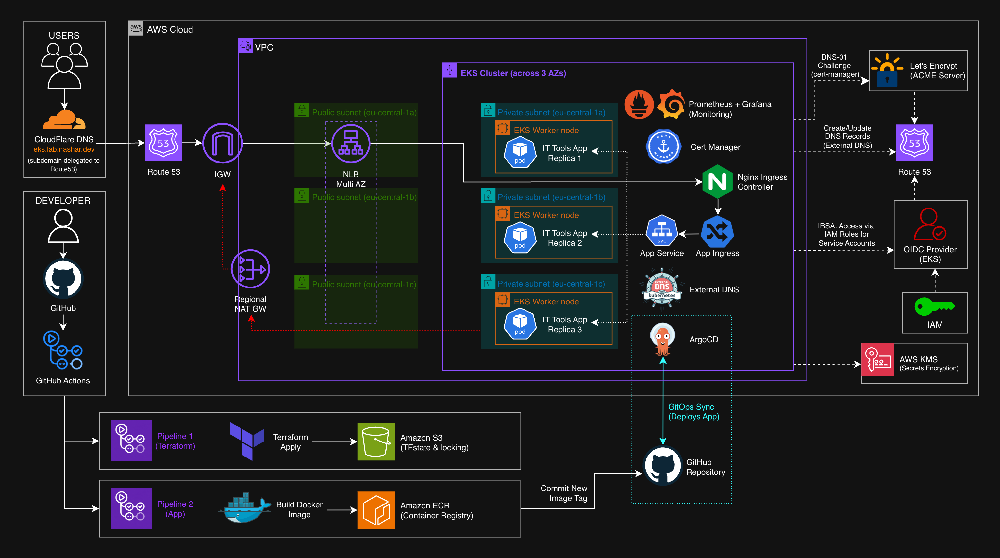
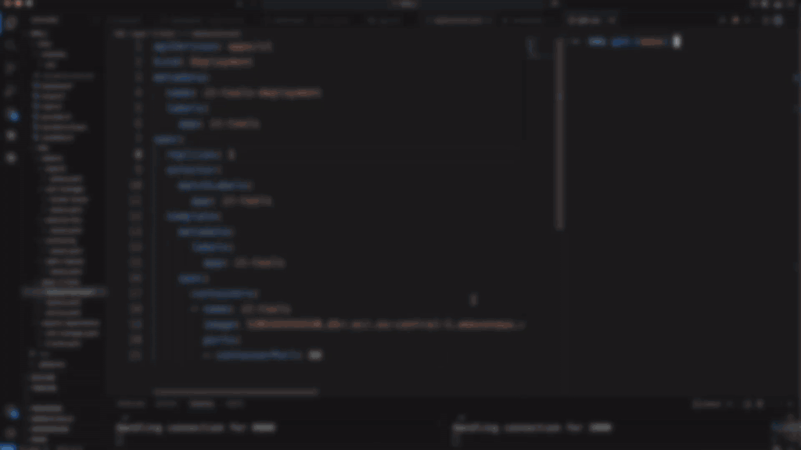

# EKS GitOps Platform


> A production grade Kubernetes platform on AWS EKS, built the way you'd actually set things up at a real company.

The goal here wasn't just to get an app running in a cluster. It was to build the full platform around it. Infrastructure as code, automatic certificates and DNS, GitOps deployments, monitoring, and a CI/CD setup with security scanning built in.

The app on top is [IT Tools](https://github.com/CorentinTh/it-tools), a lightweight set of developer utilities built with Vue.js. It's intentionally simple and not the focus. It just gives me something real to route traffic to, secure with HTTPS, and ship through the pipeline. The platform underneath is the actual project.

During the build it was served over HTTPS at `https://eks.lab.nashar.dev`. The infrastructure gets torn down between sessions to keep costs down, so the screenshots below show the running setup.

---

## Highlights

| | |
|---|---|
| 🧱 **Custom Terraform modules** | VPC and EKS written from scratch, no community modules |
| 🔑 **Zero static credentials** | CI/CD authenticates to AWS through GitHub OIDC |
| 🛡️ **Least privilege by default** | Pod level AWS access via IRSA, not broad node roles |
| 🚪 **Single entry point** | One NLB serves the whole cluster through NGINX Ingress |
| 🔒 **Automated TLS and DNS** | cert-manager and external-dns, no manual Route53 steps |
| 🔁 **GitOps reconciliation** | ArgoCD keeps the cluster in sync with Git |
| ✅ **Security gates in CI/CD** | Checkov on infra, Trivy on images, manual approval on apply |
| 📦 **Multi-stage image** | 30.07 MB (multi-stage build) |
| ⚡ **Full stack provisioned** | _resource count / deploy time to be added after deployment_ |

---

## Architecture



Traffic comes in through a single Network Load Balancer that AWS provisions automatically when the NGINX Ingress Controller is deployed. NGINX handles the HTTP routing inside the cluster and forwards each request to the right service. Worker nodes sit in private subnets across three availability zones, and only the load balancer lives in the public subnets, so nothing in the cluster is directly exposed to the internet.

DNS and certificates are fully hands off. When an Ingress is created, external-dns picks it up and writes the matching record into Route53, while cert-manager requests a certificate from Let's Encrypt and proves domain ownership through a DNS challenge, also in Route53. Both reach AWS through IRSA, so each pod only gets the exact permissions it needs.

---

## Key Decisions

The choices below were deliberate, and they shaped how the whole thing fits together.

**Custom Terraform modules over community ones.**
I wrote the VPC and EKS modules myself instead of pulling in the popular community modules. Those modules are solid, but they hide a lot. Writing my own forced me to understand how the cluster, the OIDC provider, the node groups and the networking actually connect. If something breaks, I know where to look.

**NLB instead of ALB.**
NGINX Ingress already does all the HTTP routing inside the cluster, so an ALB in front would just duplicate that work. A Network Load Balancer sits at layer 4 and passes traffic straight through to NGINX. Simpler, cheaper, and one load balancer for everything instead of one per service.

**IRSA for pod permissions.**
Instead of giving the nodes broad IAM permissions that every pod inherits, each workload that needs AWS access gets its own role through IAM Roles for Service Accounts. cert-manager and external-dns can touch Route53. Nothing else can. Small blast radius, clear trust boundaries.

**S3 backend with native locking.**
State lives in S3 using the native `use_lockfile` locking from Terraform 1.10, so there's no separate DynamoDB table to manage.

**GitHub OIDC for CI/CD.**
The pipelines get short lived tokens from GitHub instead of storing long lived AWS keys. The trust policy is locked to this specific repo, so a fork can't assume the role.

**ArgoCD over direct kubectl.**
The pipeline never runs `kubectl apply`. It builds the image, scans it, pushes to ECR, and updates the image tag in Git. ArgoCD watches the repo and reconciles the cluster. Git is the source of truth, and manual changes get pulled back in line automatically.

---

## Stack

| Area | Tools |
|------|-------|
| Infrastructure | Terraform (custom VPC and EKS modules) |
| Kubernetes | Amazon EKS |
| Ingress | NGINX Ingress Controller (NLB) |
| TLS | cert-manager + Let's Encrypt |
| DNS | external-dns + Route53 |
| GitOps | ArgoCD |
| CI/CD | GitHub Actions |
| Security scanning | Checkov (Terraform), Trivy (images) |
| Monitoring | Prometheus + Grafana (kube-prometheus-stack) |
| Registry | Amazon ECR |
| App | IT Tools (Vue.js) |

---

## CI/CD

Two pipelines, two jobs.

**Terraform pipeline** handles the infrastructure. It runs Checkov to catch security misconfigurations, checks formatting, validates, and runs a plan. The apply step sits behind a manual approval gate, so nothing changes in AWS until I sign off. Plan and apply are split, so apply only runs if plan succeeds.

**App pipeline** handles IT Tools. It builds the image, scans it with Trivy, pushes to ECR tagged with the Git commit SHA, then updates the image tag in the deployment manifest and commits that back. That commit is what triggers ArgoCD to roll out the new version. The pipeline itself never deploys. It builds, scans, pushes, and points ArgoCD at the new image.

Both authenticate to AWS through GitHub OIDC. No static credentials anywhere.

---

## Demo

### Live GitOps Deployment



*Scaling IT Tools from 1 to 3 replicas — pushing to Git triggers an automatic ArgoCD sync with no manual kubectl apply.*

### Full Walkthrough
https://www.youtube.com/watch?v=2qmWjiU949A

---

## Deployment

The setup runs in two stages: a one time bootstrap that creates the resources Terraform itself needs (S3 state backend, ECR, GitHub OIDC), then the main infrastructure and add-ons. ArgoCD takes over deployments from there.

Full step by step deployment and teardown guide → [deployment_guide.md](deployment_guide.md)

---

## Repository Structure

```
eks-gitops-platform/
│
├── .github/workflows/
│   ├── terraform.yml
│   └── app.yml
│
├── app/
│   ├── Dockerfile
│   ├── .dockerignore
│   └── it-tools/
│
├── infra/
│   ├── bootstrap/
│   │   ├── main.tf
│   │   ├── locals.tf
│   │   └── outputs.tf
│   ├── main.tf
│   ├── locals.tf
│   ├── variables.tf
│   ├── backend.tf
│   ├── provider.tf
│   ├── terraform.tfvars
│   └── modules/
│       ├── vpc/
│       │   ├── main.tf
│       │   ├── variables.tf
│       │   └──outputs.tf
│       └── eks/
│           ├── main.tf
│           ├── iam.tf
│           ├── irsa.tf
│           ├── access.tf
│           ├── helm-releases.tf
│           ├── variables.tf
│           └── outputs.tf
│
├── k8s/
│   ├── addons/
│   │   ├── nginx-ingress/
│   │   │   └── values.yaml
│   │   ├── cert-manager/
│   │   │   ├── values.yaml
│   │   │   └── cluster-issuer/
│   │   │       └── cluster-issuer.yaml
│   │   ├── external-dns/
│   │   │   └── values.yaml
│   │   ├── argocd/
│   │   │   └── values.yaml
│   │   └── monitoring/
│   │       └── values.yaml
│   ├── apps/
│   │   └── it-tools/
│   │       ├── deployment.yaml
│   │       ├── service.yaml
│   │       └── ingress.yaml
│   └── argocd/
│       └── applications/
│           ├── it-tools.yaml
│           └── cert-manager.yaml
│
│
├── README.md
├── images 
└── deployment_guide.md
```